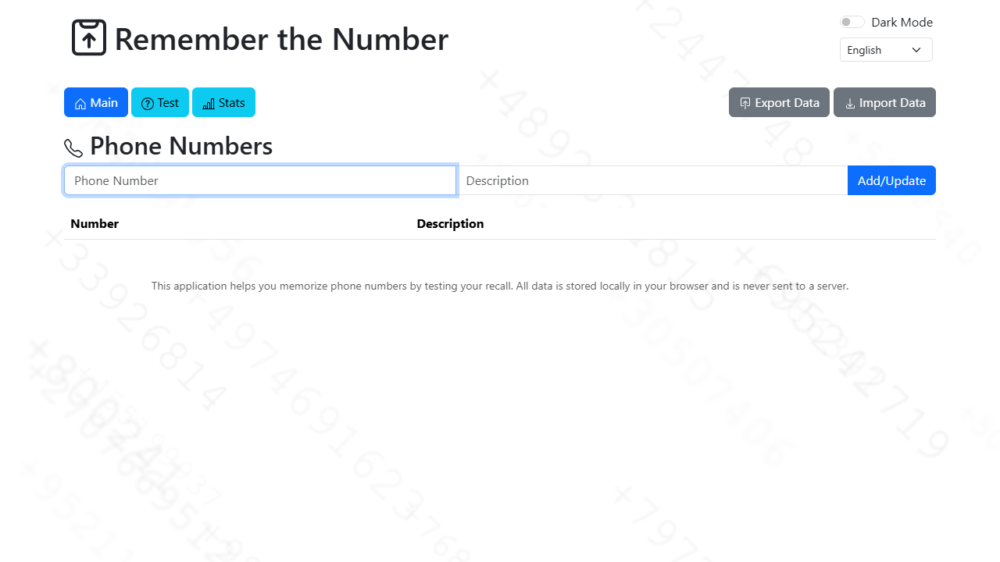
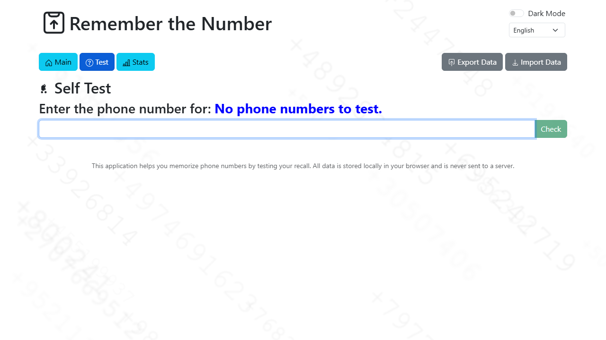
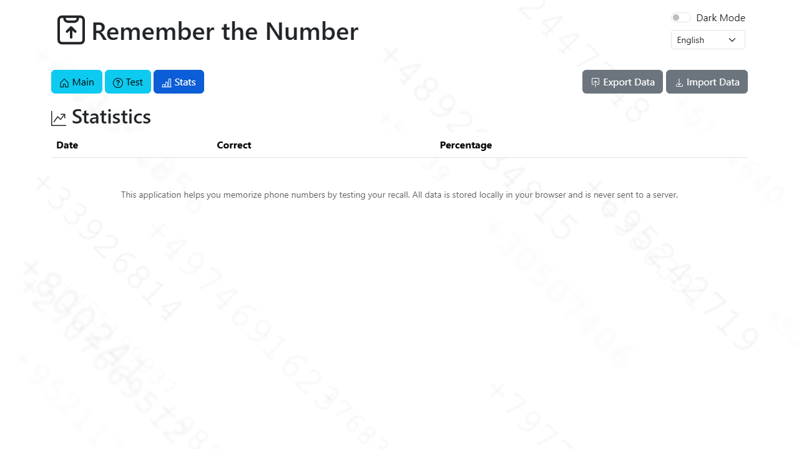

# Phone Number Memorization Tool

This is an interactive web application designed to help users memorize phone numbers through self-testing. All data is stored locally in the user's browser for privacy.

## Features

- **Add/Manage Phone Numbers:** Easily add new phone numbers with descriptions, and edit or delete existing ones.
- **Self-Testing Mode:** Practice recalling phone numbers with an interactive testing interface that provides immediate feedback.
- **Performance Statistics:** Track your memorization progress with detailed statistics, including correct answers and percentages over time.
- **Data Import/Export:** Securely back up your phone number data by exporting it to a JSON file, and restore it by importing the file.
- **Multi-language Support:** The application supports multiple languages for a localized user experience.
- **Dark Mode:** A toggle for a comfortable viewing experience in low-light conditions.
- **Dynamic Background:** A subtle, animated background featuring blurry, blinking digit sequences for an engaging visual.

## Screenshotsle

### Main Screen


### Test Screen


### Statistics Screen


## Technical Description

This application is built using standard web technologies:

- **HTML5:** For structuring the content.
- **CSS3:** For styling, including Bootstrap 5 for responsive design and custom styles for the dynamic background.
- **JavaScript (ES6+):** For all application logic, data management, and UI interactions. The application uses a modular approach with separate files for data handling (`data.js`), UI updates (`ui.js`), core logic (`logic.js`), and background animations (`background.js`).
- **Local Storage:** All user data (phone numbers, statistics, language preference, theme preference) is stored securely in the browser's local storage, ensuring privacy and offline access.
- **Canvas API:** Used in `background.js` to render the dynamic, animated digit sequences efficiently.
- **Playwright:** Used for automated browser testing and generating screenshots.

## Getting Started

To run this application locally:

1.  Clone the repository:
    ```bash
    git clone <repository-url>
    ```
2.  Navigate to the project directory:
    ```bash
    cd phone-remember
    ```
3.  Open `index.html` in your web browser.

